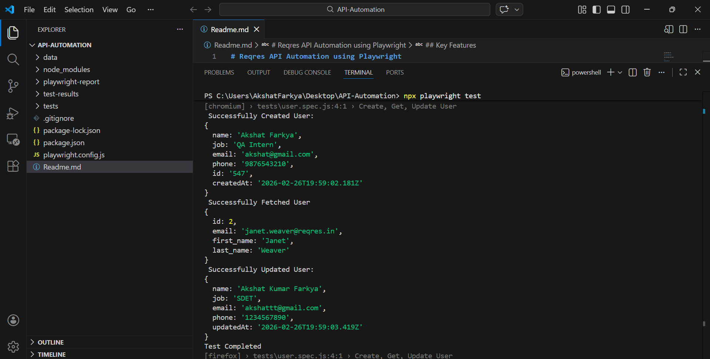
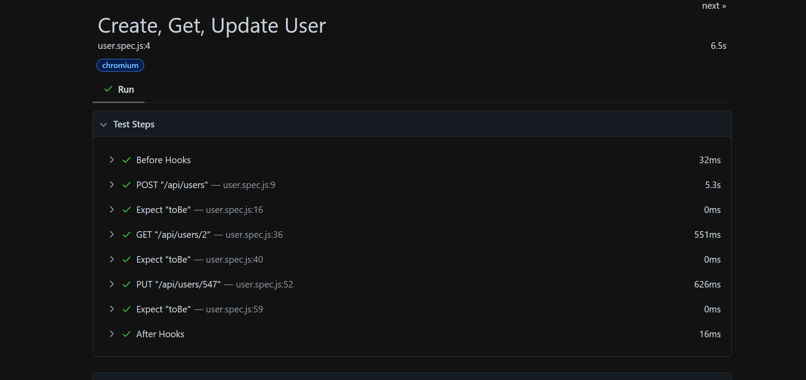

# Reqres API Automation Assignment using Playwright

## Overview

This repository contains automated API tests for the **Reqres** demo service, implemented using **Playwright Test**.

Public API under test: `https://reqres.in/`

The test suite currently covers the following HTTP operations end‑to‑end:

- **Create User (POST)**
- **Fetch User Details (GET)**
- **Update User (PUT)**

The test suite validates HTTP status codes and response data to ensure correct API behavior.

---

##  API Operations Covered

### Create User (POST)

- Sends user data (name, job, email, phone)
- Validates HTTP status code `201`
- Extracts and stores the generated `userId`
- Prints selected response fields:
  - name
  - job
  - email
  - phone
  - id
  - createdAt

---

### Fetch User (GET)

- Sends a GET request to retrieve user details
- Validates HTTP status code `200`
- Verifies response structure
- Prints selected fields:
  - id
  - email
  - first_name
  - last_name

---

### Update User (PUT)

- Updates user details (name and job)
- Validates HTTP status code `200`
- Confirms updated response values
- Prints selected fields:
  - name
  - job
  - email
  - phone
  - updatedAt

---

## 🛠 Tech Stack

- Playwright Test
- JavaScript (Node.js)
- Reqres Public API

---

## Playwright Configuration

The project uses a custom `playwright.config.js` configuration with:

- Base URL:
  https://reqres.in

- Global HTTP headers:
  - Content-Type: application/json
  - x-api-key

- HTML Reporter enabled
- Parallel execution enabled
- CI retry configuration supported

---

## Project Structure

```
project-root/
│
├── data/
│   └── userData.js        # Test data (payloads, user details, etc.)
│
├── tests/
│   └── user.spec.js       # API test cases for Reqres endpoints
│
├── playwright.config.js   # Playwright configuration (baseURL, headers, reporters)
└── README.md
```

---

## Prerequisites

- **Node.js** (LTS version recommended, e.g. 18+)
- **npm** (comes with Node.js)
- Internet access to reach `https://reqres.in/`

---

##  How to Run the Project

### Install Dependencies

```bash
npm install
```

### Run Tests

```bash
npx playwright test
```

### View HTML Report

```bash
npx playwright show-report
```

---

## Key Features

- API automation using Playwright request context
- Validation of HTTP status codes
- Response body verification
- Separate test data management
- Centralized configuration setup
- Clean and structured logging

---
## 🖼 Result Snapshots

### Successful Execution


### Detailed HTML Report



## Note

Reqres is a mock API service.
Data created using POST requests is not permanently stored.  
Therefore, dynamically created users may not be retrievable using GET requests.

---